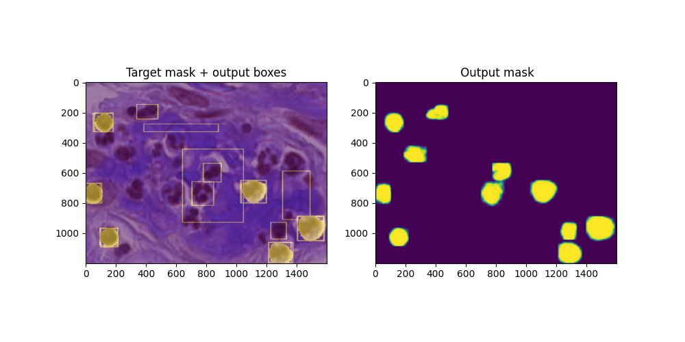
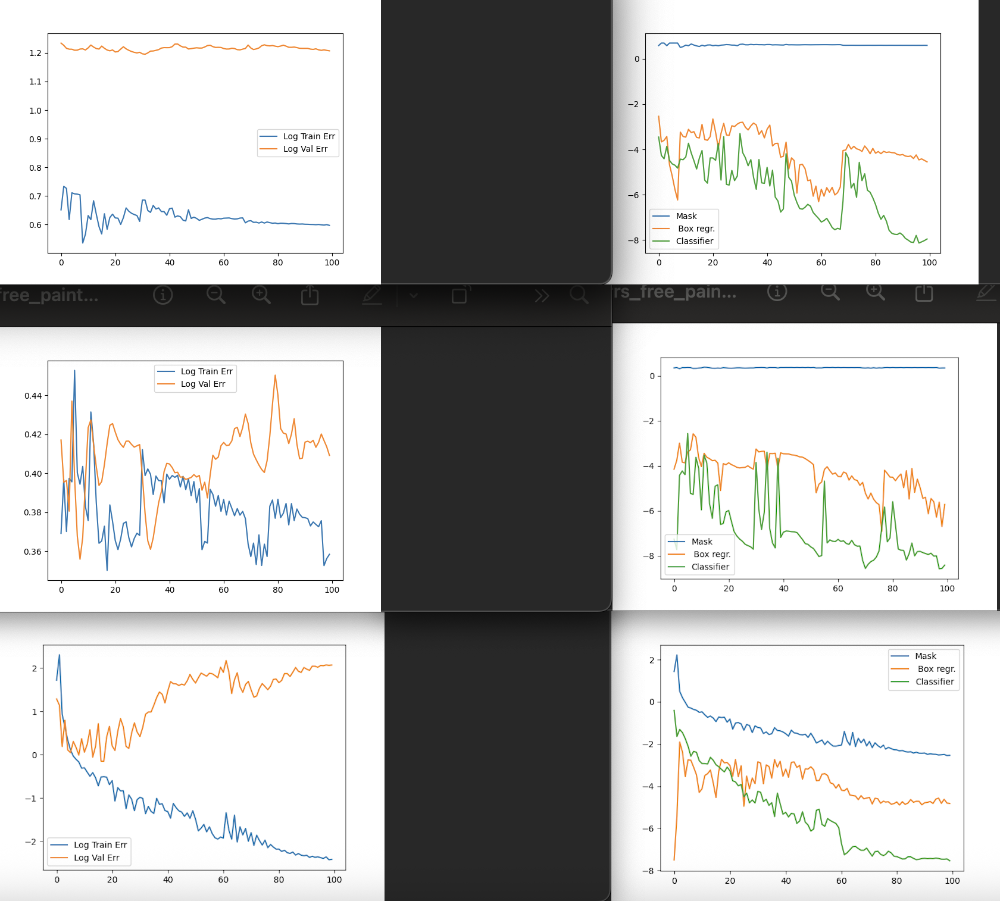
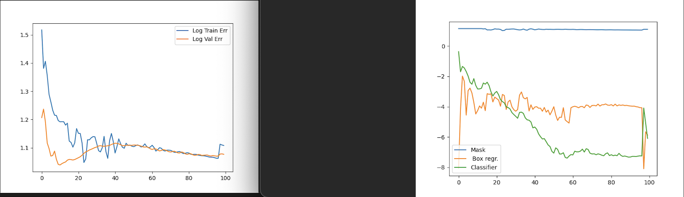
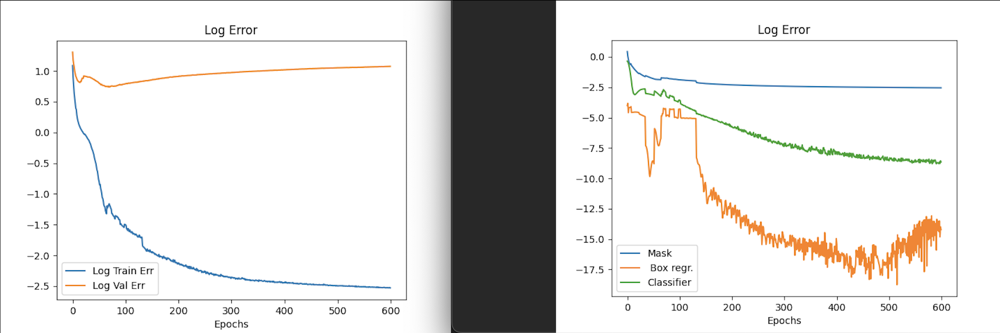
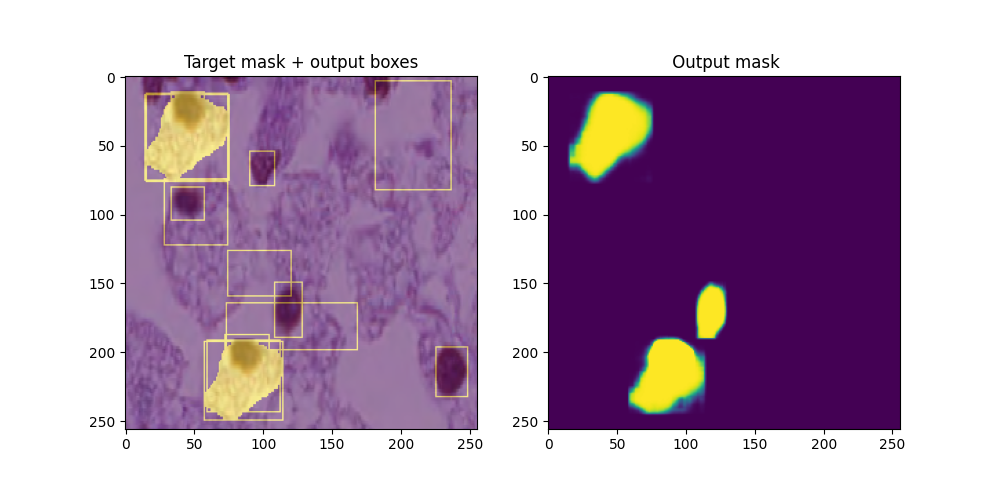
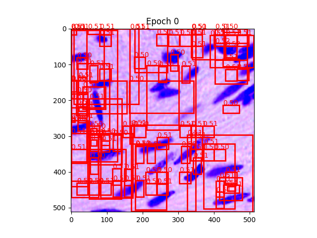
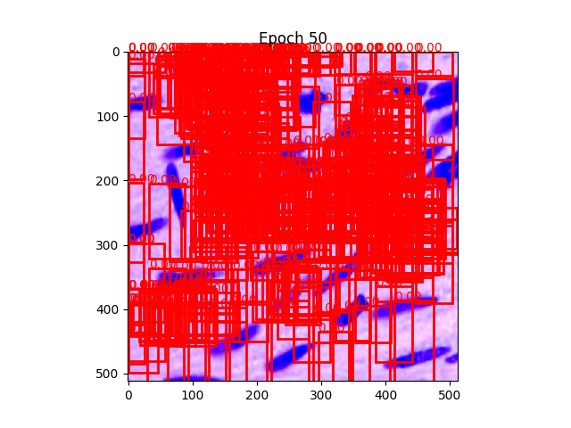
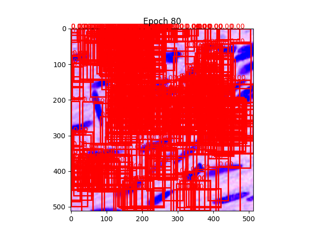

# Mask-R-CNN for image-manipulation detection (current state)




This repository presents an experimental Mask R-CNN–based approach for detecting image manipulations, developed as part of the Kaggle competition Recod.ai / LUC – Scientific Image Forgery Detection. The project documents the stepwise fine-tuning, parameter exploration and the systematic **debugging** process of a complex instance segmentation pipeline.

## ⚙️ Motivation

Detecting manipulated regions in scientific images requires **precise localization** based on subtle image artifacts such as discontinuities in lightning and noise.
Instance segmentation models such as Mask R-CNN focus only on the relevant regions of interest, but require a **backbone/feature extractor** that is specialized on such artifacts.
We start from a pre-trained model with a generic ResNet backbone which we **fine-tune in different phases**, yielding an acceptable result.
Run:
```
python3 scoring.py
```
to obtain the main result of our final model `pretrained_final.pth`:
```
 MEAN oF1s (the main metric):
0.414 +- 0.428
 RECALL:
0.842 +- 0.337
 PRECISION:
0.859 +- 0.0
```


The main conclusion states that the **bottleneck** lies in the classifier head, which is not able to distinguish forged regions from authentic regions.
This, in turn, is caused by a generic feature extractor that was never trained to detect forgery features.


### 🟢 Description of Mask R-CNN

**Mask-R-CNN** is a region based algorithm for detection, classification and segmentation of images.

Mask R-CNN is a multi-stage convolutional neural network that performs:
- Region proposal (RPN)
- Bounding box regression
- Object classification
- Instance mask segmentation
Therefore it is also hard to debug which parts are failing, although we managed to narrow the **problem** down to the **classifier head**.

##  Approach

- Inspired by the Kaggle notebook  
  https://www.kaggle.com/code/antonoof/eda-r-cnn-model  
  which implements a Mask R-CNN–based pipeline but reports no quantitative results.

- The notebook provides a solid starting point in terms of network architecture, data loading, and training loops. However, it lacks systematic numerical debugging and step-wise validation of individual model components (e.g. RPN, box regression, mask head).  
  This project aims to fill that gap by introducing structured debugging steps and targeted experiments to isolate failure modes.
  
## 📈 Stepwise fine-tuning

We start from a COCO-pretrained Mask R-CNN but replace the original classifier (80 classes/objects) by a binary classifier (forged / authentic). Then we follow:

1. **Overfit a single image**  
   - Image: `10017.png` (shown below)
   - Goal: achieve broad direction for the classifier + mask weights
   - Strategy: freeze parts of the network (e.g. backbone)

2. **Overfit a small subset (5 images)**  
   - Goal: Show classifier + mask different examples and shapes
   - Strategy: Alternate between freezing backbone and heads

3. **Train on the full dataset**
   - Goal: Multi-stage generalization
   - Unfreeze last backbone layer and the classifier

Weights are reused between steps to enable incremental fine-tuning.

## 💡 Quick EDA:
- There are 5K images to train and 50 images for testing
- The problem has a pixel-imbalance, around 5% of the pixels are forged and are therefore `1`s in their corresponding masks.
- The signal is very weak, the algorithm has to learn to detect discontinuities in noise along copy-pasted edges, contrasts in brightness etc.

## Code:
Run

```
pip install -r requirements.txt
python3 edarnn.py
```


for training and
```
python3 encode_submission.py
```
for evaluation (DICE) over a test_dataset and visualization.

The dataset is composed of both authentic and forged/manipulated images, which are accompanied by a mask. The overfit image (10017.png) used throughout this report contains two forgery regions.

## 🔑 Training

First we thought that the bounding box regression was failing - we tried to combine two strategies, giving four models:
1. Freezing vs not freezing the mask head (responsible for segmenting the image)
2. Painting vs not painting bounding boxes around the forged regions to make sure this error is not used.

We will see that one of the four models outperforms the others:




So we train it for 600 epochs:



then run:
```
python3 encode_submission.py
```

and obtain:

```
Model weights: 
<All keys matched successfully>
../recodai-luc-scientific-image-forgery-detection/train_images/forged/47.png
 Combining 2 masks and resizing to original
 Combining 100 masks and resizing to original
Box 0: score = 0.0985
Box 1: score = 0.0740
Box 2: score = 0.0720
Box 3: score = 0.0677
Box 4: score = 0.0668
Box 5: score = 0.0593
Box 6: score = 0.0505
Box 7: score = 0.0500
Box 8: score = 0.0459
Box 9: score = 0.0450
Target masks shape: torch.Size([1, 256, 320]), sum per mask: 1177.0
Pred mask stats -> sum: 23129.7480
Full true mask stats -> sum: 1177.0000
Intersection: 107.3293, Denominator: 24306.7480, DICE: 0.008831

Idx: 0 DICE: 0.0088

```

## 🧠 Results

The target img/mask in the left side includes the two target bounding boxes, as well as the 10 best scoring predicted boxes from the model.
We can see that the network has learnt to find the correct box size and regress it towards the target
- The **mask and box** regression look good ✅

But the log above shows that the **classifier struggles** to distinguish between authentic and forged regions. ❌
- This is due to the **generic feature vectors** from ResNet, which have not (yet) been trained to encode forgery features.
  
Because of that, our model is over-segmenting the image, a problem that we couldnt solve via thresholding.
As a proof, we enforced the original GT_scores and observed a significant increase in the final oF1 score.



## 🚀 Conclusion / further work


** Plotting the bounding box regression for different epochs:**






