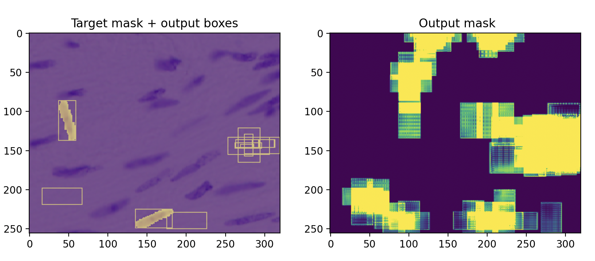

# Mask-R-CNN for image-manipulation detection (current state)




This repository presents an experimental Mask R-CNN–based approach for detecting image manipulations, developed as part of the Kaggle competition Recod.ai / LUC – Scientific Image Forgery Detection. The project documents both the implementation, parameter exploration and the systematic **debugging** process of a complex instance segmentation pipeline.

## Motivation

Detecting manipulated regions in scientific images requires precise localization, not just classification.  
Instance segmentation models such as Mask R-CNN are a natural fit for this task, but their complexity makes them difficult to debug and validate.
This project focuses on understanding where it fails and finding a systematic approach for the implementation of **multiple** Neural Networks.


### Description of Mask R-CNN

**Mask-R-CNN** is a region based algorithm for detection, classification and segmentation of images.

Mask R-CNN is a multi-stage convolutional neural network that performs:
- Region proposal (RPN)
- Bounding box regression
- Object classification
- Instance mask prediction
Therefore it is also hard to debug which parts are failing, although we managed to narrow the **problem** down to the **Bounding Box regressor** inside the RPN.

## Approach

- Inspired by the Kaggle notebook  
  https://www.kaggle.com/code/antonoof/eda-r-cnn-model  
  which implements a Mask R-CNN–based pipeline but reports no quantitative results and only a single qualitative prediction on an authentic image (without a predicted mask).

- The notebook provides a solid starting point in terms of network architecture, data loading, and training loops. However, it lacks systematic numerical debugging and step-wise validation of individual model components (e.g. RPN, box regression, mask head).  
  This project aims to fill that gap by introducing structured debugging steps and targeted experiments to isolate failure modes.
  
## Experimental Strategy

To validate correctness, we follow a strict progression:

1. **Overfit a single image**  
   - Image: `10017.png` (shown below)
   - Goal: perfectly reproduce ground-truth masks
   - Strategy: freeze parts of the network (e.g. mask head or backbone)

2. **Overfit a small subset (5 images)**  
   - Isolate whether failures generalize beyond one sample
   - Alternate between freezing backbone and heads

3. **Train on the full dataset**  
   - Only attempted once earlier stages succeed

Weights are reused between steps to enable incremental fine-tuning.

## Quick EDA:
- There are 5K images to train and 50 images for testing
- The problem has a pixel-imbalance, around 5% of the pixels are forged and are therefore `1`s in their corresponding masks.
- The signal is very weak, the algorithm has to learn to detect discontinuities in noise along copy-pasted edges, contrasts in brightness etc.

## Code:
Run

```
pip install -r requirements.txt
python3 edarnn.py
```


for training and
```
python3 encode_submission.py
```
for evaluation (DICE) over a test_dataset and visualization.

The dataset is composed of both authentic and forged/manipulated images, which are accompanied by a mask. The overfit image (10017.png) used throughout this report contains two forgery regions.

## Training

Since we know that the RPN is failing, we tried to combine two strategies, giving four models:
1. Freezing vs not freezing the head mask (responsible for segmenting the image)
2. Painting vs not painting bounding boxes around the forged regions to make sure this error is not used.

We will see that one of the four models outperforms the others:


So we train it for 600 epochs:


then run:
```
python3 encode_submission.py
```

and obtain:

```
Model weights: 
<All keys matched successfully>
../recodai-luc-scientific-image-forgery-detection/train_images/forged/10017.png
 Combining 2 masks and resizing to original
 Combining 100 masks and resizing to original
Box 0: score = 0.0985
Box 1: score = 0.0740
Box 2: score = 0.0720
Box 3: score = 0.0677
Box 4: score = 0.0668
Box 5: score = 0.0593
Box 6: score = 0.0505
Box 7: score = 0.0500
Box 8: score = 0.0459
Box 9: score = 0.0450
Target masks shape: torch.Size([1, 256, 320]), sum per mask: 1177.0
Pred mask stats -> sum: 23129.7480
Full true mask stats -> sum: 1177.0000
Intersection: 107.3293, Denominator: 24306.7480, DICE: 0.008831

Idx: 0 DICE: 0.0088

```
The resulting image shows out target in the left, but it also includes the two target bounding boxes, as well as the 10 best scoring predicted boxes from the model. We can see that the network has learnt to find the correct box size and regress it towards the target. However the overfit is not successful, and the classification score above is also very unsure about whether the regions are authentic or forged.


Plotting the boxes for different epochs also did not highlight any new information:


and it seems that, despite decreasing error, the boxes do not improve a lot from epoch 50 on.


