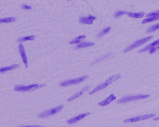

# Mask-R-CNN for image-manipulation detection (current state)

This project is part of the Kaggle competition "Recod.ai/LUC" and shows the current state of the project, 
flaws that could be overcome and lays a path for future work once some problems are solved.

### Description of Mask R-CNN

Mask R-CNN is a Convolutional Neural Network (CNN) and a state-of-the-art model that performs object detection and instance segmentation. 
This Deep Neural Network variant detects objects in an image and generates high-quality segmentation masks for each instance.

It is a state-of the art model composed of a Region Proposal Network (RPN), CNN encoder, a classifier and segmentation, all in one.
Therefore it is also hard to debug which parts are failing, although we managed to narrow the problem down to the Bounding Box regressor inside the RPN.

# Approach:
- Inspired by: https://www.kaggle.com/code/antonoof/eda-r-cnn-model, who however does not present any results, other than a single, maskless prediction (an authentic image).
- Provides NN architecture, Dataloading pipeline, training loops, but NOT: steps for numerical debugging or step-wise tests for the different NN parts. We could provide some insights.

## Steps:
1. The first step is overfitting the model to a single image: 10017.png (see image below). To simplify the initial task, we freeze part of the network (the mask head).
2. Then we train only the mask segmentation (we freeze the backbone) and try to overfit 5 images.
3. Unfreeze everything, train on the whole dataset.
   

The first image contains two forgery regions masked in yellow (because they have been manipulated within the image). Here we found already some flaws in the pipeline, but most importantly, the model is not able to overfit.

Trying to track it down, we plotted the Bounding boxes, which after overfit should be the same as the ground truth:

## image

We go one step further, freeze the mask_head completely but also paint the original masks with just plain white rectangles on top of the regions.
This should completely separate the regression problem of the bounding boxes. The difference is noticeable:

## image of the errors without painting/freezing VS with painting/freezing.

## Boxes gemalt, entspricht nicht der BBox des Bildes.
